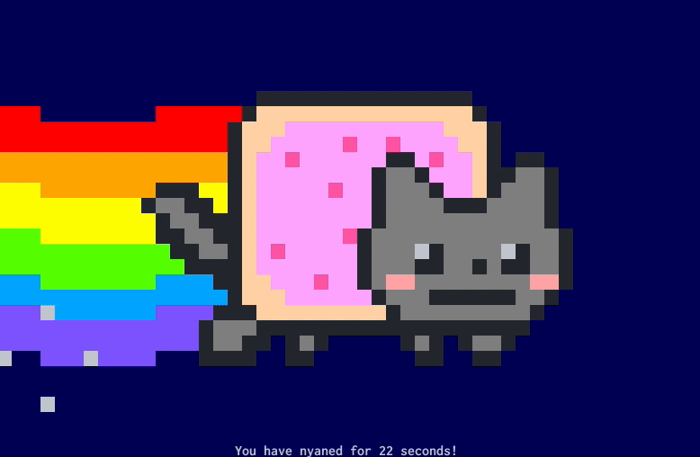

# NyancatSH

Nyancat over SSH!

`ssh dir.charm.sh -p2226`




## Installation

```sh
go install github.com/aymanbagabas/nyancatsh@latest
nyancatsh
```

Or, if you want to run Nyancat locally without an SSH server:

```sh
go install github.com/aymanbagabas/nyancatsh/cmd/nyancat@latest
nyancat
```

This is based on a couple of [Charm](https://github.com/charmbracelet)'s packages:

- [bubbletea](https://github.com/charmbracelet/bubbletea): TUI framework
- [lipgloss](https://github.com/charmbracelet/lipgloss): Styling
- [wish](https://github.com/charmbracelet/wish): SSH apps

## Resources

- [Nyancat CLI](https://github.com/klange/nyancat)
- [Go Nyancat](https://github.com/NARKOZ/go-nyancat)
